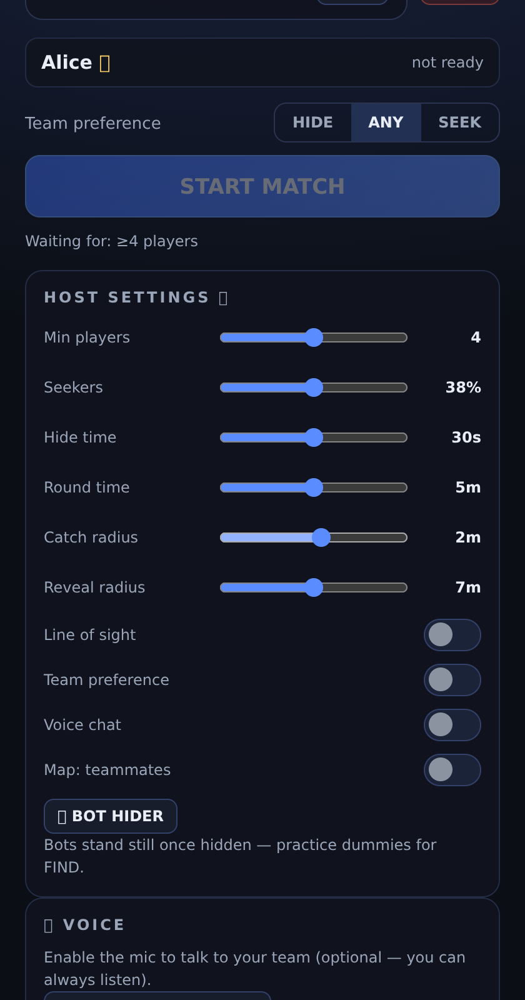
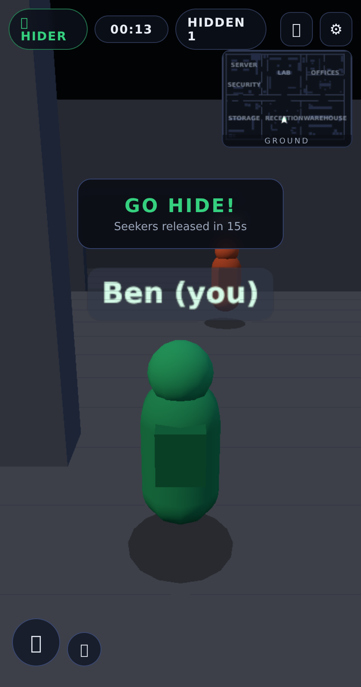
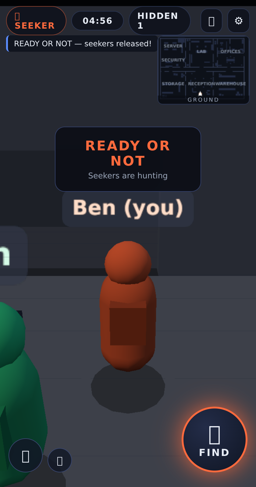
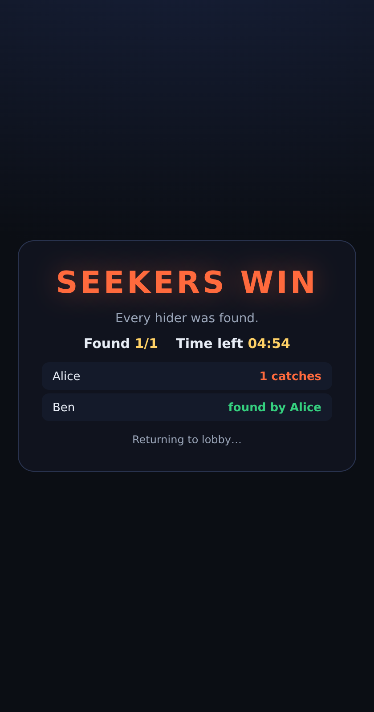

# 🔎 BLACKWOOD — Real-Time Multiplayer Hide & Seek

A complete, playable multiplayer hide-and-seek game. Friends join a private room
with a 6-character code, get split into **HIDERS** and **SEEKERS**, and play a
round inside a virtual 3D research facility — with **team voice chat**, a
server-authoritative **FIND/catch system** (real distance + line-of-sight
checks), and a proper round loop (hide → hunt → catch → results).

**100% browser-based** — nothing to install for players. Phones and desktops
play together.

| Lobby | Hider hiding | Seeker FIND! | Results |
|---|---|---|---|
|  |  |  |  |

---

## ⚡ Quick start (plug & play)

Requires [Node.js 18+](https://nodejs.org) (20/22 recommended).

```bash
cd hide-and-seek
npm install        # installs socket.io (+ dev tools)
npm start          # http://localhost:8080
```

Open **http://localhost:8080** in a browser (phone or desktop). To play with
friends on the same Wi‑Fi, they use your LAN IP (`http://192.168.x.x:8080`);
over the internet, see [deployment](docs/DEPLOYMENT.md) — or just keep reading.

**Solo test drive (30 seconds):** create a room → scroll the host panel:
*Min players* → `2`, *Hide time* → `15s` → **＋ BOT HIDER** → **START MATCH**.
You'll be a seeker or a hider against a stationary practice bot. Open a second
browser tab (or your phone) and join with the room code for a real opponent.

### Playing on phones
1. Start the server, find your computer's LAN IP (`ipconfig` / `ifconfig`).
2. On the phone, open `http://THAT-IP:8080`.
3. Left thumb = virtual joystick, right side drag = camera, buttons for
   jump/sprint. Hold **🎤** (or `V` on desktop) to talk.

### Controls

| Action | Mobile | Desktop |
|---|---|---|
| Move | virtual joystick | `WASD` |
| Look | drag right side of screen | mouse (drag or pointer lock) |
| Sprint | joystick to the edge / `🏃` | `Shift` |
| Jump | `⬆` | `Space` |
| **FIND (seekers)** | big 🔎 button | `F` or click |
| Push-to-talk | hold `🎤` | hold `V` |
| Mute self | `🔊` toggle | `M` |

---

## 🎮 How a round works

```
LOBBY → TEAM_ASSIGNMENT (6s reveal) → PREPARATION (hiders hide, seekers
blindfolded) → ACTIVE_ROUND (hunt!) → ROUND_END → RESULTS → LOBBY
```

- **Hiders** scatter through the facility. Enemies can't even *see* you on
  their screen until they are within **reveal radius (7 m)** **and** have line
  of sight — and your position is never sent to their client at all before that.
- **Seekers** are released when preparation ends. Get close and the FIND
  button lights up — but only within **catch radius (2 m)** and only with a
  clear line of sight (no catching through walls). The **server re-measures
  both** on every press; a hacked client enabling the button catches nothing.
- Caught hiders become **FOUND** — visible to everyone, free to roam, and no
  longer count for the hiders' win.
- **Seekers win** if every hider is found. **Hiders win** if the timer expires
  with at least one hider hidden. Disconnecting hiders forfeit after a grace
  period (no invisible winners).
- Every rule above is a config value — see [Configuration](#-configuration).

## 🗺️ The map — Blackwood Research Facility

One polished, three-level prototype map built for hiding:

- **Ground floor:** reception atrium, laboratory (fume hoods, benches),
  server room (rack aisles), security (lockers, monitors), two offices +
  meeting room, storage (shelf rows, crate stacks), warehouse (tall shelf
  aisles, crate maze, forklift) — connected by looping corridors with **two
  secret vents**.
- **Basement (`B1`):** the Archives — stairs down from storage, shelf rows,
  a dead-end closet, and a **secret ladder** back up into the atrium.
- **Rooftop (`RF`):** exterior service stairs in the east alley, AC units,
  water tank — a parapet gap marks the way in.
- Tall props (≥1.3 m) block line of sight; low props block movement but you
  can be seen over them. Multiple routes, dead ends, and no single dominant
  spot: 173 validated hiding nooks.

## 🎤 Team voice chat

Real-time voice with **hard team isolation**: the server assigns each player
to their team's channel when the round starts and **only relays WebRTC
signaling inside a channel** — a modified client cannot talk across teams.
Push-to-talk (default) or open mic, per-player mute, volume control, speaking
indicators, permission handling, and automatic channel switching (shared lobby
channel between rounds). Audio flows peer-to-peer (WebRTC mesh + free STUN)
— no voice server cost. The provider is behind a swappable interface
(`client/js/voice/`) so LiveKit/Photon Voice/Vivox can drop in later.

---

## 📁 Project structure

```
hide-and-seek/
├── shared/               # SAME code on server + client (single source of truth)
│   ├── constants.js      #   phases, teams, wire protocol event names
│   ├── config.js         #   GameConfig defaults + clamped host settings
│   ├── geometry.js       #   distance, segment-vs-AABB raycasts, collision math
│   └── map.js            #   the facility: boxes, props, spawns, labels, LOS data
├── server/               # authoritative game server (Node.js + Socket.IO)
│   ├── index.js          #   entry: HTTP + static files + Socket.IO + config
│   ├── socket-api.js     #   wire handlers (rooms, lobby, movement, catch, voice)
│   ├── rooms.js          #   room registry: codes, create/join, idle cleanup
│   ├── game-room.js      #   state machine, timers, snapshots, win conditions,
│   │                     #   disconnect/reconnect, host migration, practice bots
│   ├── players.js        #   authoritative player state
│   ├── teams.js          #   team assignment (preferences, ratio)
│   ├── movement.js       #   speed/teleport/phase validation → corrections
│   ├── catch.js          #   THE FIND validation (distance + LOS + status)
│   ├── visibility.js     #   per-viewer filtered snapshots (no wall-hacks)
│   └── voice.js          #   team channel assignment + signaling relay
├── client/               # mobile-first web client (Three.js, no build step)
│   ├── index.html        #   screens: home / lobby / HUD / results / settings
│   ├── css/style.css     #   mobile-first UI
│   ├── vendor/           #   three.js (vendored, runs offline)
│   └── js/
│       ├── main.js       #     boot, screen orchestration, game loop
│       ├── world.js      #     3D scene (one merged mesh = tiny draw-call count)
│       ├── avatar.js     #     characters + procedural animation + nameplates
│       ├── controller.js #     input, physics, collision, ladders, camera, net
│       ├── remote.js     #     interpolated remote players
│       ├── visibility→server, hud.js, minimap.js, lobby.js, audio.js (synth SFX)
│       └── voice/        #     provider interface + WebRTC mesh implementation
├── test/
│   ├── unit/             # catch validation, LOS, visibility, rooms, teams,
│   │                     # movement anti-cheat, voice isolation, state machine
│   └── integration/      # acceptance.test.js = the spec's §38 scenario end-to-end
├── tools/                # verify-map.mjs, browser-smoke/e2e/screenshots
└── docs/                 # deployment, testing, architecture, limitations, future
```

## 🔒 Anti-cheat design (what the client is NOT trusted for)

| State | Owner |
|---|---|
| Position used for catches | server (client moves are speed-validated; violations get authoritative corrections, abuse gets kicked) |
| Catch distance & line of sight | server re-measures both on every FIND press |
| Teams, statuses, found flags | server |
| Round timer | server clock (clients sync via NTP-lite offset) |
| Visibility | server — hidden enemies' coordinates are simply not transmitted to the other team |
| Match result, win conditions | server |
| Voice channel assignment | server (cross-team signaling relay is refused) |

## ⚙️ Configuration

All gameplay rules live in [`shared/config.js`](shared/config.js) `DEFAULT_CONFIG`
(min/max players, seeker ratio, prep/round durations, catch radius, LOS toggle,
reveal radius, movement speeds, voice, tick rates, anti-cheat tolerances…).

- **Hosts** change the popular ones live in the lobby (clamped server-side).
- **Server operators** can override anything via `config.local.json` (see
  `config.local.json.example`) or `PORT`, `MAX_ROOMS`, `STUN_URLS` env vars.
- Nothing gameplay-related is hard-coded elsewhere — the catch radius appears
  once, in config.

## 🧪 Testing

```bash
npm test            # 81 tests: unit + full acceptance scenario (spec §38)
npm run verify:map  # map connectivity: flood-fills all 3 floors, all rooms/vents
# optional real-browser tools (see tools/BROWSER-TOOLS.md for one-time setup):
#   browser-smoke.mjs  – boots a real headless browser against the client
#   browser-e2e.mjs    – TWO real browsers play a full match incl. the FIND catch
```

Details: [docs/TESTING.md](docs/TESTING.md). The acceptance test literally
walks the spec's scenario: 7 players + bot join, teams split, 8 m → hidden
and rejected, 2.5 m → visible but TOO_FAR, 1.8 m with LOS → caught, wall →
NO_LINE_OF_SIGHT, reconnect restores a hider, all-found → SEEKERS WIN, timer
expiry → HIDERS WIN.

## 🚀 Deployment

One process serves everything (static client + game server). Free tiers work
fine for friend groups — see [docs/DEPLOYMENT.md](docs/DEPLOYMENT.md) for
Fly.io/Railway/Render one-liners, VPS + systemd, and HTTPS notes (mic access
requires HTTPS except on localhost).

## 💰 Cost, limitations, roadmap

- **Zero cost at dev/friends scale**: Node server (free tiers), WebRTC p2p
  voice (free STUN), no database, no accounts, vendored assets.
- **Not free forever**: TURN relay for strict NATs (~$0.40/GB), an SFU for
  large voice rooms, more CPU as rooms scale. Discussed honestly in
  [docs/LIMITATIONS-AND-COST.md](docs/LIMITATIONS-AND-COST.md).
- **Roadmap**: abilities (scan pulse, decoys — config flag already exists),
  more maps (registry in place), matchmaking, accounts/stats, Unity port
  notes — [docs/FUTURE.md](docs/FUTURE.md).

## 🧭 Why this stack (instead of Unity/Photon)

The design brief recommends Unity + Photon. This repository delivers the same
architecture with a **zero-install web stack** (Three.js + Node + Socket.IO +
WebRTC) so the game is instantly playable on any phone — every system
(state machine, server validation, visibility filtering, team voice,
config) is engine-agnostic and maps 1:1 to a Unity/Fusion port if you later
want native apps. See [docs/ARCHITECTURE.md](docs/ARCHITECTURE.md).

---

**License:** MIT (Three.js is vendored under its own MIT license, see
`client/vendor/THREE.LICENSE.txt`).
