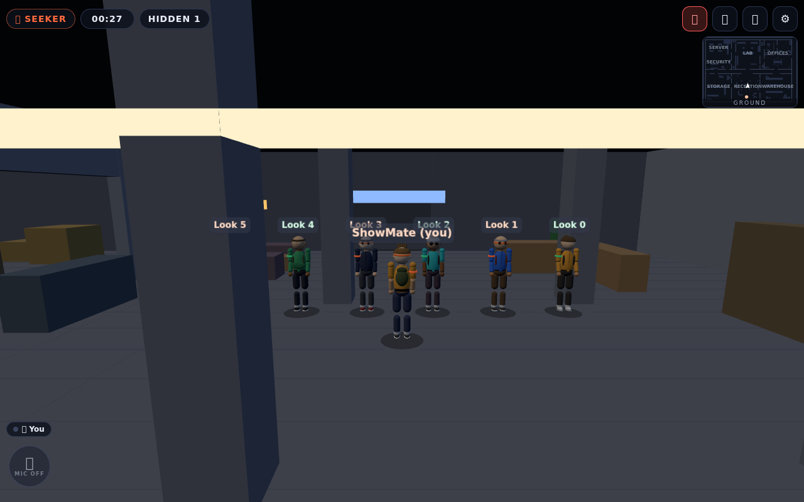
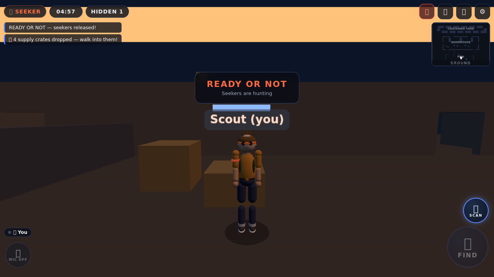
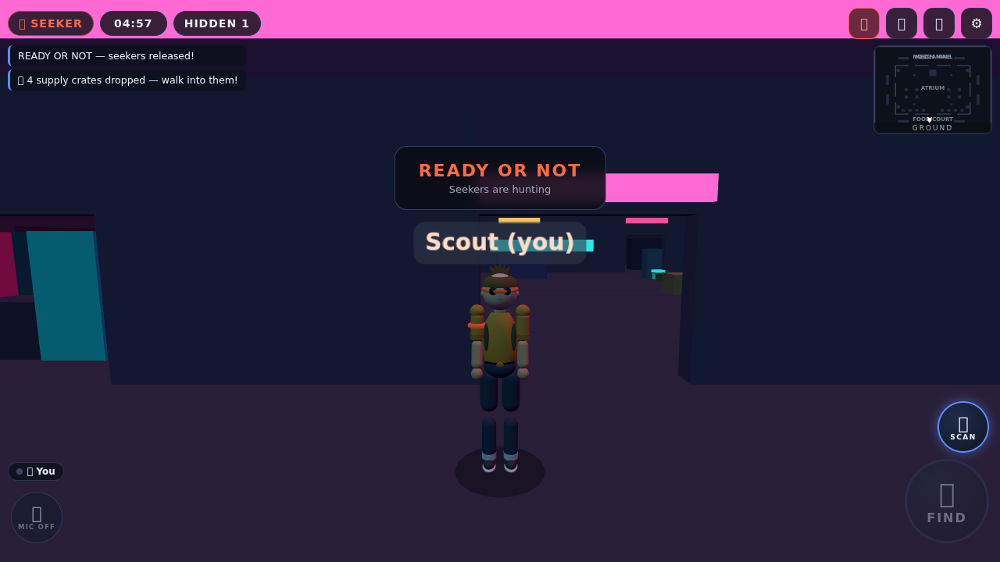

# 🔎 BLACKWOOD — Real-Time Multiplayer Hide & Seek

A complete, playable multiplayer hide-and-seek game. Friends join a private room
with a 6-character code, get split into **HIDERS** and **SEEKERS**, and play a
round inside a virtual 3D research facility — with **team voice chat**, a
server-authoritative **FIND/catch system** (real distance + line-of-sight
checks), and a proper round loop (hide → hunt → catch → results).

**100% browser-based** — nothing to install for players. Phones and desktops
play together.

| Hider hiding | Seeker FIND! | Characters | The Old Docks | Mall of Shadows |
|---|---|---|---|---|
|  |  |  |  |  |

---

## ⚡ Quick start (plug & play)

Requires [Node.js 18+](https://nodejs.org) (20/22 recommended).

```bash
cd hide-and-seek
npm install        # installs socket.io (+ dev tools)
npm start          # http://localhost:8080
```

Open **http://localhost:8080** in a browser (phone or desktop). To play with
friends on the same Wi‑Fi, they use your LAN IP (`http://192.168.x.x:8080`);
over the internet, see [deployment](docs/DEPLOYMENT.md) — or just keep reading.

**Solo test drive (30 seconds):** create a room → scroll the host panel:
*Min players* → `2`, *Hide time* → `15s` → **＋ BOT HIDER** → **START MATCH**.
You'll be a seeker or a hider against a stationary practice bot. Open a second
browser tab (or your phone) and join with the room code for a real opponent.

### Playing on phones
1. Start the server, find your computer's LAN IP (`ipconfig` / `ifconfig`).
2. On the phone, open `http://THAT-IP:8080`.
3. Left thumb = virtual joystick, right side drag = camera, buttons for
   jump/sprint. Hold **🎤** (or `V` on desktop) to talk.

### Controls

| Action | Mobile | Desktop |
|---|---|---|
| Move | virtual joystick | `WASD` / arrows |
| Look | drag right side of screen | mouse (drag or pointer lock) — drag down looks down (toggle *Invert look Y* in settings to flip) |
| Sprint | joystick to the edge / `🏃` (hold or tap-to-lock) | `Shift` |
| Jump | `⬆` (taps under one frame still count) | `Space` |
| **FIND (seekers)** | big 🔎 button | `F` or click |
| **Scan pulse (seekers)** | 📡 button (above the sprint cluster) | `Q` — pings revealed hiders within 18 m, 25 s cooldown |
| Push-to-talk | hold `🎤` | hold `V` |
| Mic on/off | 🎤 button in HUD **and** lobby | `M` (or the button) |
| Speaker mute (deafen) | 🔇 button in HUD **and** lobby | `N` or the button |
| Per-player volume | lobby voice panel (slider per player) | lobby voice panel |

The camera is a normal (non-inverted) third-person orbit: dragging the mouse
**down** looks **down**, dragging **right** rotates the view right. This was a
reported bug — see [Changelog](#-changelog).

---

## 🎮 How a round works

```
LOBBY → TEAM_ASSIGNMENT (6s reveal) → PREPARATION (hiders hide, seekers
blindfolded) → ACTIVE_ROUND (hunt!) → ROUND_END → RESULTS → LOBBY
```

- **Hiders** scatter through the facility. Enemies can't even *see* you on
  their screen until they are within **reveal radius (7 m)** **and** have line
  of sight — and your position is never sent to their client at all before that.
- **Seekers** are released when preparation ends. Get close and the FIND
  button lights up — but only within **catch radius (2 m)** and only with a
  clear line of sight (no catching through walls). The **server re-measures
  both** on every press; a hacked client enabling the button catches nothing.
- Caught hiders become **FOUND** — visible to everyone, free to roam, and no
  longer count for the hiders' win.
- **Seekers win** if every hider is found. **Hiders win** if the timer expires
  with at least one hider hidden. Disconnecting hiders forfeit after a grace
  period (no invisible winners).
- **Hosts** moderate from the lobby: kick any player (confirm for humans),
  remove practice bots, and edit room settings live — every action is
  host-validated server-side, so a modified client cannot kick.
- Every rule above is a config value — see [Configuration](#-configuration).

## 🗺️ The maps — three playables, host picks

The **host chooses the map when creating the room** (the joiner sees it in
the lobby). All three are pure data in [`shared/map.js`](shared/map.js)
(`MAPS` registry), rendered as one merged mesh per map, and verified by
`npm run verify:map` (flood-fill connectivity + spawn + hide-spot checks for
*every* map).

- **Blackwood Research Facility** (`facility`) — the original three-level
  indoor maze, **cold blue-white lighting**: reception atrium, laboratory,
  server room, security, offices + meeting room, storage, warehouse,
  **two secret vents**, a **basement** (Archives with a secret ladder back
  up) and a **rooftop** (exterior service stairs, AC plant, water tanks,
  maintenance shed). **209 hiding nooks.**
- **The Old Docks** (`docks`) — a single-floor industrial yard under **warm
  amber sodium lamps on a night sky**: a **container yard** (four-colour
  containers + a yellow gantry-crane landmark), a central **warehouse**
  (four open bays, rack aisles, forklift) and a **pier** (sheds, crates,
  barrels). **89 hiding nooks.**
- **Mall of Shadows** (`mall`) — a single-floor abandoned arcade bathed in
  **neon magenta + cyan**: perimeter **shops** with lit shopfronts, a central
  **atrium** (fountain, planters), a **food court**, a multicolour **arcade
  row**, and a raised **DJ stage**. **64 hiding nooks.**

Each map carries its own **scene identity** (sky, fog, key/fill lighting) so
the three maps feel like three different places, not one room repainted.
Every map: glowing **signage** + minimap labels (decorative — never block
movement or line of sight); tall props (≥1.3 m) block line of sight, low
props block movement only; **no hide spot lands within 7 m of a seeker spawn**
(fairness rule, config `hideSpotMinSeekerDistance`), and `verify:map` now
also proves **every walkable cell has floor under it** (this caught a real
hole in the facility's north atrium where players could fall out of the world
and practice bots "hid" standing in mid-air).

### 📦 Supply crates (server-authoritative loot)

Every hunt drops **4 crates** at random validated spots:
- **⚡ Boost crate** (gold) — walk into it: +40 % move speed for 10 s. The
  anti-cheat speed cap is raised *server-side* for the same window, so it's a
  genuine advantage, not a client trick.
- **🕶 Cloak crate** (cyan) — **hidden hiders only**: for 10 s the hider is
  *invisible to enemies and uncatchable* (the server omits them from enemy
  snapshots and rejects catches with `CLOAKED`). Teammates can still see them.

Crates appear in the world as glowing spinning crates; pickup is a
server-checked radius check; effects show as a HUD countdown chip plus a
glow on the avatar (gold boost / cyan cloak).

## 🎭 Characters & feel

Every player gets a **Free Fire-style stylized character**: a smooth
low-poly humanoid (no more Minecraft cubes) with a per-player *deterministic*
look — **painted face** (eyes, brows, nose, mouth on a canvas texture),
skin tone, hair style + colour, hat, tee/hoodie/jacket (zipper, collar,
hood, pocket, cuffs, hem), pants, boots, backpack, glasses — seeded from the
player id so **every client renders the same player identically**. Materials
use PBR-style shading (per-surface roughness) under each map's lighting.
Team cues are built in: green armband for hiders, orange armband + goggles
for seekers.

Animation is fully procedural and speed-driven (so it stays in sync with the
footstep audio): walking and running gait with scissoring legs, arm swing,
knee/elbow bend, hip-vs-chest counter-rotation and body bob; idle breathing;
airborne tuck and a landing squash.

Game-feel layer on top: positional **footsteps for everyone** (distance
attenuation + stereo pan, distinct hider/seeker timbres, jump/land), a
**proximity heartbeat + red vignette** for hiders when a seeker closes in,
round intro sting, catch flash, and the seeker **scan pulse** (Q / 📡) that
pings revealed hiders within 18 m on a 25 s cooldown.

## 🎤 Team voice chat

Real-time voice with **hard team isolation**: the server assigns each player
to their team's channel when the round starts and **only relays WebRTC
signaling inside a channel** — a modified client cannot talk across teams.
Push-to-talk (default) or open mic, always-visible **mic on/off** and
**speaker mute** buttons (HUD + lobby), per-player volume sliders in the
lobby voice panel, speaking indicators (nameplate 🎤 + HUD chips), permission
handling, and automatic channel switching (shared lobby channel between
rounds). Muting is leak-proof: a muted mic cannot transmit even while
push-to-talk is held. Audio flows peer-to-peer (WebRTC mesh + free STUN) —
no voice server cost. The provider is behind a swappable interface
(`client/js/voice/`) so LiveKit/Photon Voice/Vivox can drop in later.

---

## 📁 Project structure

```
hide-and-seek/
├── shared/               # SAME code on server + client (single source of truth)
│   ├── constants.js      #   phases, teams, wire protocol event names
│   ├── config.js         #   GameConfig defaults + clamped host settings
│   ├── geometry.js       #   distance, segment-vs-AABB raycasts, collision math
│   └── map.js            #   the facility: boxes, props, spawns, labels, LOS data
├── server/               # authoritative game server (Node.js + Socket.IO)
│   ├── index.js          #   entry: HTTP + static files + Socket.IO + config
│   ├── socket-api.js     #   wire handlers (rooms, lobby, movement, catch, voice)
│   ├── rooms.js          #   room registry: codes, create/join, idle cleanup
│   ├── game-room.js      #   state machine, timers, snapshots, win conditions,
│   │                     #   disconnect/reconnect, host migration, practice bots
│   ├── players.js        #   authoritative player state
│   ├── teams.js          #   team assignment (preferences, ratio)
│   ├── movement.js       #   speed/teleport/phase validation → corrections
│   ├── catch.js          #   THE FIND validation (distance + LOS + status)
│   ├── visibility.js     #   per-viewer filtered snapshots (no wall-hacks)
│   └── voice.js          #   team channel assignment + signaling relay
├── client/               # mobile-first web client (Three.js, no build step)
│   ├── index.html        #   screens: home / lobby / HUD / results / settings
│   ├── css/style.css     #   mobile-first UI
│   ├── vendor/           #   three.js (vendored, runs offline)
│   └── js/
│       ├── main.js       #     boot, screen orchestration, game loop
│       ├── world.js      #     3D scene (one merged mesh = tiny draw-call count)
│       ├── avatar.js     #     characters + procedural animation + nameplates
│       ├── controller.js #     input, physics, collision, ladders, camera, net
│       ├── remote.js     #     interpolated remote players
│       ├── visibility→server, hud.js, minimap.js, lobby.js, audio.js (synth SFX)
│       └── voice/        #     provider interface + WebRTC mesh implementation
├── test/
│   ├── unit/             # catch validation, LOS, visibility, rooms, teams,
│   │                     # movement anti-cheat, voice isolation, state machine
│   └── integration/      # acceptance.test.js = the spec's §38 scenario end-to-end
├── tools/                # verify-map.mjs, browser-smoke/e2e/screenshots
└── docs/                 # deployment, testing, architecture, limitations, future
```

## 🔒 Anti-cheat design (what the client is NOT trusted for)

| State | Owner |
|---|---|
| Position used for catches | server (client moves are speed-validated; violations get authoritative corrections, abuse gets kicked) |
| Catch distance & line of sight | server re-measures both on every FIND press |
| Teams, statuses, found flags | server |
| Round timer | server clock (clients sync via NTP-lite offset) |
| Visibility | server — hidden enemies' coordinates are simply not transmitted to the other team |
| Match result, win conditions | server |
| Voice channel assignment | server (cross-team signaling relay is refused) |

## ⚙️ Configuration

All gameplay rules live in [`shared/config.js`](shared/config.js) `DEFAULT_CONFIG`
(min/max players, seeker ratio, prep/round durations, catch radius, LOS toggle,
reveal radius, movement speeds, voice, tick rates, anti-cheat tolerances…).

- **Hosts** change the popular ones live in the lobby (clamped server-side).
- **Server operators** can override anything via `config.local.json` (see
  `config.local.json.example`) or `PORT`, `MAX_ROOMS`, `STUN_URLS` env vars.
- Nothing gameplay-related is hard-coded elsewhere — the catch radius appears
  once, in config.

## 🧪 Testing

```bash
npm test            # 184 tests: unit (movement math, camera look convention,
                    #   kick permissions, voice state, phase machine, remote
                    #   interpolation, map) + full acceptance scenario (spec §38)
npm run verify:map  # map connectivity + spawns + hide spots for EVERY map
                    #   (facility 210 / docks 81 / mall 64 nooks)
# optional real-browser tools (see tools/BROWSER-TOOLS.md for one-time setup):
#   browser-smoke.mjs     – boots a real headless browser against the client
#   browser-e2e.mjs       – TWO real browsers play a full match incl. the FIND catch
#   browser-matrix.mjs    – the strict-tester matrix: 106 checks across desktop
#                           WASD + mouse-look convention, iPhone-13 touch
#                           emulation (joystick/sprint/jump), a real WebRTC mic
#                           exchange between two contexts (fake mics),
#                           measurable SFX (WebAudio) firing, host
#                           kick/remove-bot, a full match, and edge cases
#                           (refresh rejoin, host migration, room full).
#                           Zero console errors allowed.
#   map-smoke.mjs         – for EVERY map: create a room on it, verify the
#                           client renders that map and spawns validly
#   playtest-panel.mjs    – captures real gameplay (one session per map) and
#                           runs a 100-agent persona panel (BR veterans,
#                           Among-Us sneaks, mobile casuals, audio/visual/
#                           netcode critics, …) over the telemetry, applying a
#                           99/100 approval gate before reporting
#   avatar-showcase.mjs   – captures the character models/gait screenshots
#   browser-screenshots.mjs – regenerates the README screenshots
```

Details: [docs/TESTING.md](docs/TESTING.md). The acceptance test literally
walks the spec's scenario: 7 players + bot join, teams split, 8 m → hidden
and rejected, 2.5 m → visible but TOO_FAR, 1.8 m with LOS → caught, wall →
NO_LINE_OF_SIGHT, reconnect restores a hider, all-found → SEEKERS WIN, timer
expiry → HIDERS WIN.

## 🚀 Deployment

One process serves everything (static client + game server). Free tiers work
fine for friend groups — see [docs/DEPLOYMENT.md](docs/DEPLOYMENT.md) for
Fly.io/Railway/Render one-liners, VPS + systemd, and HTTPS notes (mic access
requires HTTPS except on localhost).

## 💰 Cost, limitations, roadmap

- **Zero cost at dev/friends scale**: Node server (free tiers), WebRTC p2p
  voice (free STUN), no database, no accounts, vendored assets.
- **Not free forever**: TURN relay for strict NATs (~$0.40/GB), an SFU for
  large voice rooms, more CPU as rooms scale. Discussed honestly in
  [docs/LIMITATIONS-AND-COST.md](docs/LIMITATIONS-AND-COST.md).
- **Roadmap**: more abilities (decoys — the scan pulse starter ability is in
  and on by default), more maps (3 now, registry makes adding more trivial),
  matchmaking, accounts/stats, Unity port notes — [docs/FUTURE.md](docs/FUTURE.md).

## 🧭 Why this stack (instead of Unity/Photon)

The design brief recommends Unity + Photon. This repository delivers the same
architecture with a **zero-install web stack** (Three.js + Node + Socket.IO +
WebRTC) so the game is instantly playable on any phone — every system
(state machine, server validation, visibility filtering, team voice,
config) is engine-agnostic and maps 1:1 to a Unity/Fusion port if you later
want native apps. See [docs/ARCHITECTURE.md](docs/ARCHITECTURE.md).

## 📜 Changelog

### 2026-08-22 (3) — floor-hole fix, map identities, painted faces, supply crates
- **Fixed a real floor hole (found via playtest + new verifier):** the
  facility's north atrium strip (z 25..31) had no floor slab — players could
  fall out of the world and practice bots "hid" standing in mid-air (23 hide
  spots there). `verify:map` now proves **every walkable cell has floor under
  it** and `computeHideSpots` refuses spots without support, so this class of
  bug is structurally prevented.
- **Each map is now its own "world":** per-map sky/fog/lighting (facility =
  cold blue-white, docks = amber sodium night, mall = neon magenta/cyan),
  docks gained a yellow gantry crane + four-colour containers, the mall
  gained lit neon shopfronts + multicolour arcade row.
- **Characters got painted faces** (canvas-textured eyes/brows/nose/mouth,
  high-contrast so they read at play distance) + PBR-style materials
  (per-surface roughness). Fixed the beanie band covering the face like a
  ninja mask; shortened the jacket zipper.
- **Supply crates (Free Fire-style loot, server-authoritative):** every hunt
  drops 4 crates — ⚡ **boost** (+40 % speed, 10 s, server raises the
  anti-cheat cap to match) and 🕶 **cloak** (hiders only: invisible to
  enemies + uncatchable, 10 s; `CLOAKED` catch rejection, snapshot
  filtering). Glowing crates in-world, HUD countdown chip, avatar glow.
- **Tests:** 174 → **184** (10 new item tests: spawn/pickup/boost-cap/cloak
  catch + visibility/DTO).

### 2026-08-22 (2) — three maps, host map picker, proven audio, 100-agent panel
- **Two new maps + a host map picker.** The host now chooses the map when
  creating a room; joiners see it. Added **The Old Docks** (container yard +
  warehouse + pier, 81 nooks) and **Mall of Shadows** (shops + atrium + food
  court + arcade + DJ stage, 64 noooks). The client swaps map geometry at
  runtime (same renderer/camera/controller) and **syncs spawns from the
  server** instead of hard-coded facility coordinates, so any map works.
  `verify:map` now flood-fills *every* map; `map-smoke.mjs` proves each map
  renders + spawns validly in a real browser.
- **Audio is now verified, not assumed.** The matrix instruments the WebAudio
  engine and asserts SFX actually schedule during play (AudioContext running,
  gain graph connected, footstep + jump/land nodes created).
- **100-agent playtest panel** (`tools/playtest-panel.mjs`): records real
  gameplay (one session per map) and runs 100 persona-driven evaluators over
  the telemetry with a 99/100 approval gate. Current result: **100/100**.
- Characters rebuilt from cubes to smooth rounded Free Fire-style humanoids
  (capsules + spheres) with faces, hair, hats, outfits, and team cues.
- **Tests:** still 174 unit tests; browser matrix now 106 checks.

### 2026-08-22 — playtest fixes, character overhaul, juice
- **Fixed: camera pitch was inverted on laptops/trackpads** — dragging the
  mouse down looked *up*. Now drag down = look down (standard), with the
  existing *Invert look Y* setting flipping it. Regression-tested in
  `test/unit/camera-look.test.js` (runs the real controller math).
- **Characters redesigned** (old: capsule + sphere "robot"): Free Fire-style
  low-poly humanoids with per-player deterministic outfits (skin, hair, hat,
  tee/hoodie/jacket, pants, boots, backpack), team armbands + seeker goggles,
  and a full procedural gait (walk/run/idle/jump/land squash) driven by real
  speed so it matches the footstep audio. Regression-tested in
  `test/unit/avatar.test.js`.
- **Fixed: W/S movement inversion, dead mobile joystick/sprint/jump**
  (joystick was literally `display:none`; touch handlers now track off the
  element, handle `touchcancel`, latch sub-frame jump taps, sprint hold or
  tap-to-lock).
- **Voice fixed end-to-end:** mute/PTT leak, listener-only clients not
  joining, iOS autoplay unlock, WebRTC negotiation deadlock (perfect
  negotiation + `replaceTrack`), ICE rate-limit drops; added always-visible
  mic on/off + speaker mute (HUD & lobby) and per-player volume.
- **Host moderation:** kick players + remove bots (host-validated, with UI).
- **Audio/feel:** positional footsteps for self *and* others (the remote-step
  speed unit bug — m/ms instead of m/s — made them silent), jump/land,
  proximity heartbeat + vignette, round intro sting, scan pulse ability.
- **Map:** basement + rooftop expanded (210 hiding nooks, was 173), glowing
  signage, no hide spot within 7 m of a seeker spawn.
- **Misc bugs:** phase state-machine re-entrancy (rounds could end during
  prep when all seekers left), host settings panel lying about its state,
  tall lobby UI clipping on short screens, remote interpolation delay in
  ms instead of s.
- **Tests:** 81 → **174** unit tests; new 99-check real-browser
  `tools/browser-matrix.mjs` (desktop, iPhone-13 touch, live WebRTC mics,
  full match, edge cases) — all green with zero console errors.

### Earlier
- Initial implementation: server-authoritative hide & seek, FIND/catch with
  distance + line-of-sight, team-isolated WebRTC voice, 3-level facility map,
  81-test suite, browser e2e.

---

**License:** MIT (Three.js is vendored under its own MIT license, see
`client/vendor/THREE.LICENSE.txt`).
